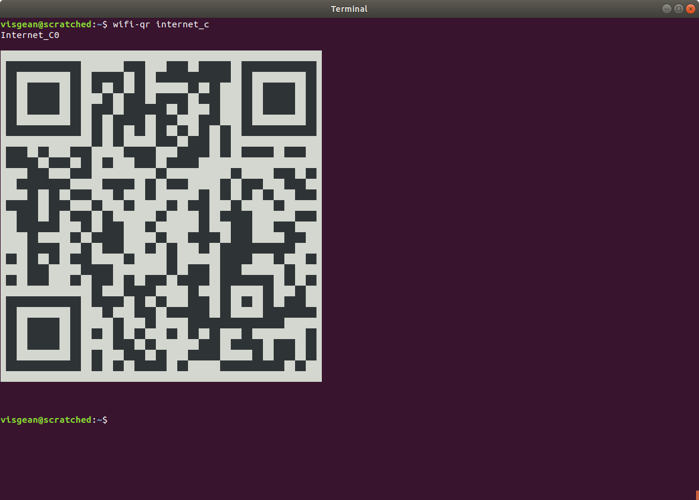

# Generate WiFI QR codes on Ubuntu

New versions of Android and iPhone can connect to wifi just by scanning QR code in the default camera application. I think this is pretty cool. Creating these QR code is a bit cumbersome in my experience.  You have to [generate it manually ](https://qifi.org/) which requires remembering the password in the first place.  

To make it a bit easier I wanted to just type the wifi name and get the QR code, which is what this project does!  

## Warning

This is **very hacky**:  

- it directly reads the `.ini` files in `/etc/NetworkManager/system-connections` and . This is almost certainly a bad way of getting wifi passwords.  
- It needs sudo access.
- It's my first Go utility and it was written mostly for fun and learning.  
- I don't plan to maintain it whatsoever :) 

## Example 



# Installation:

```
$ go get github.com/Visgean/qr-wifi
```

(Plus you need to make sure that you have a `$GO_PATH/bin` in your `.bashrc` path.)

# Usage


Show QR codes for all networks:

```
$  sudo $GOPATH/bin/qr-wifi 
```

Filter networks by name:

```
$  sudo $GOPATH/bin/qr-wifi cafe1
```


## Hacky way to get rid of sudo:

I only use it on personal, encrypted computer to which no-one else has access to, so I don't care much for security on this level. Therefore I am happy to use this permission to avoid typing sudo: 

```
$ sudo chown root:root `which qr-wifi`
$ sudo chmod 4775 `which qr-wifi`
```

Read more about it [here](https://unix.stackexchange.com/questions/18830/how-to-run-a-specific-program-as-root-without-a-password-prompt)


# Kudos:

This project is based on [@fumiyas/qrc](https://github.com/fumiyas/qrc).
